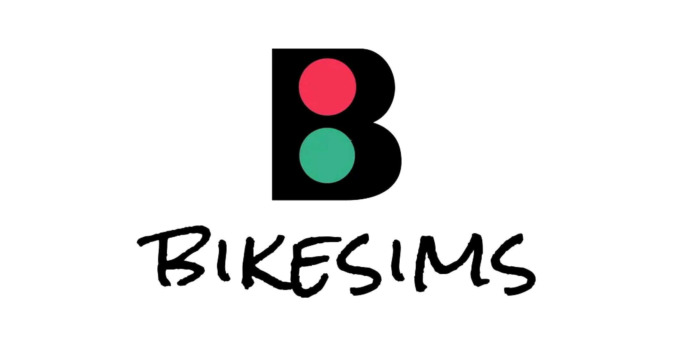

# Bike-Share-System

The bike-sharing system named **BikeSims** is built by the members of the group **Lab 1_2d** as an outcome of the team project. It provides several graphical user interfaces (GUI) and demonstrates a general bike rental process. For more info regarding the description of building the project, please refer to our report.

## How to Run BikeSims

The system is not packaged as an executable file, and the command prompt is needed to run it. Taken the Windows platform as an example, the steps of the recommended way are listed as follows.

1. In the command prompt, navigate to the project directory whose name should contain `Bike-Share-System` (e.g., `C:\Bike-Share-System-main`).
2. Run the command `python setup.py`. It will check and install any missing third-party package. If everything is fine, it will import the entry to the system and execute it. You may refer to the text file [`requirements.txt`](./requirements.txt) for the list of the required packages.
3. It should be good to go if you see a login view.

## System Requirements

- Windows 7 or above.
- Python 3 (version 3.7 or above recommended) with required packages installed.

We have tested that BikeSims can be error-free if the above requirements are satisfied.

Additionally, most functionality can work properly on other platforms like MacOS, since we mainly use [`tkinter`](https://docs.python.org/3/library/tkinter.html) and [`ttk`](https://docs.python.org/3/library/tkinter.ttk.html) of Python. However, we have not specially optimised the performance on these platforms because it is not our top priority.

## Lab 1_2d's Group Members

- Antonios Evmorfopoulos
- Jiamin Ji
- Jichen Zhao
- Nan Chen
- Shihao Chen
- Xiaoran Kang
- Yuan Gao

Time is limited, and we have attempted to achieve as much as possible. Hope you feel satisfied with BikeSims!
